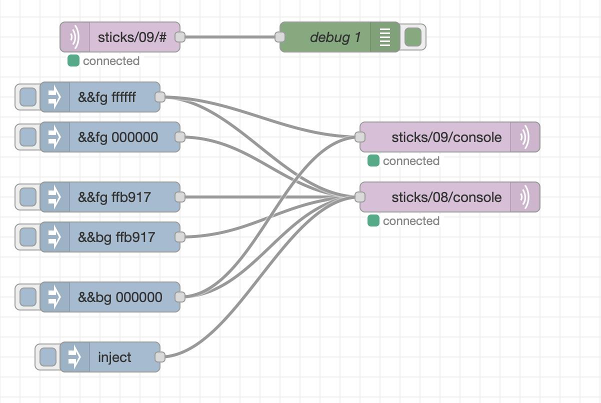
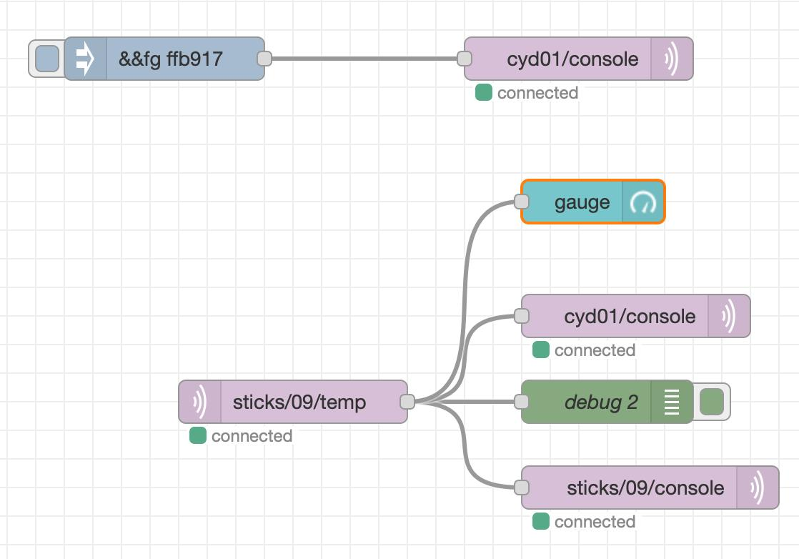
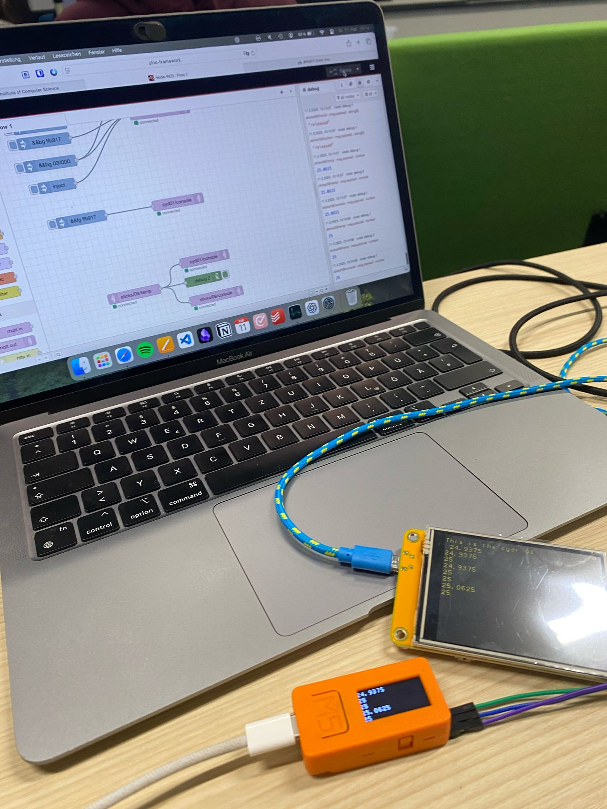

# Module 1

## Task Inspirations

- Drones!! I would love tho explore the fild on IoT with drones so dead!
- Land inspection/automatrization of farm process.

## Task Personal Profile

#### What is it: 
Synchronization of huge amounts fo real-time data and decision planning/action accordingly 

#### Domains:
* Agriculture - Increment of people to be fed leads to an urgency for automatization.
* Smart City - Sensors everywhere to know the status of the city in the current moment.
    * The phone has the best sensors!
    * IoT helps to analyze the complex factors of a particular city.
* Wearables - Fit Bits - 
    * Guardian glucose monitoring device

#### Data protocols:
* MQTT - MQTT allows communication between nodes in both reliable and unreliable networks
    * Queue / Topic - publish/subscribe
    * Light protocols: It is easy for working on remotes divices 
* Http - Sockets 

#### Typical devices:
* RasbPBerry - Arduiono
* Microcontrollers - Activators - sensors
* Cellphones!

#### Live demo:
* Benefits: Get hands durty! The demo shows us what could happend when things are connected!
* Challenges:
    * connectivity
    * security
    * Backup: Things could fail at demos, what could we do as a backup plan?
    * It is so big: How can we simplify the elements on the solution
    * Automatization: manual steps to configure the solution could lead to human mistakes
* Noteworthy: 
* Inspirational:

## Reflection 1
[Reflection 1](../Reflections/ref01.md)

## JSON
[Flow](./flows.json)

## Pictures

