# Module 2

> **_NOTE:_**  All the work was with my teammate Martinm aka [LogicLobster](https://github.com/LogicLobster/IoT-Tartu-Spring25)

## Task 1

## Reflection 2
[Reflection 2](../Reflections/ref02.md)

## Task 2 - Mini project: Blink an LED

**Notes** : This one was a good introduction to start warming up againg with the MCU and to set up the enviroment!

> Main code: [main.cpp](./code/Blink3/src/main.cpp)

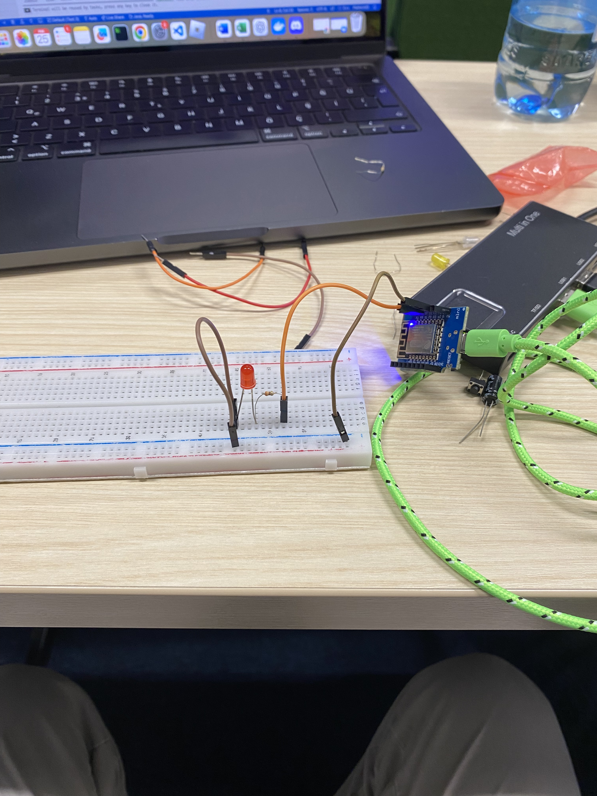
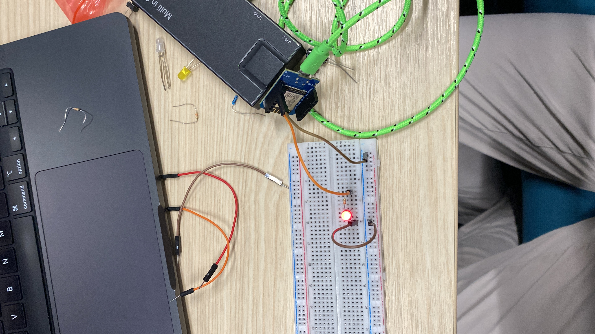

---

## Task 3 - Mini project: Reading analog values

**Notes** : I did not know about Voltage divider circuit, we implemented with two cycles.

> Main code: [main.cpp](./code/VoltageDevider3/src/main.cpp)

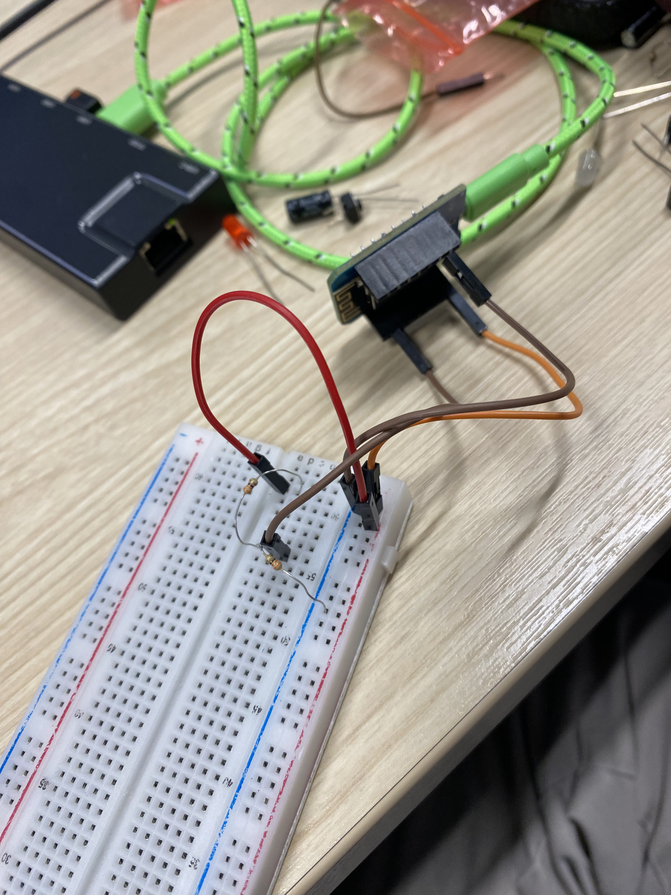
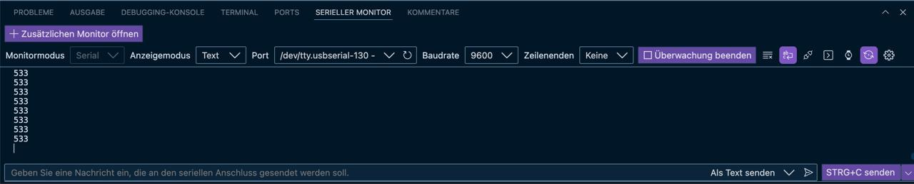

## Task 4 - Mini project: Pick-mpr121 touch sensor and build touch interface

**Notes** : We were confuse at the beginign regarding the IC2 bus, but after checking the documentation and the help on Discord we were abel to achive this one.

> Main code: [main.cpp](./code/TouchSensor3/src/main.cpp)

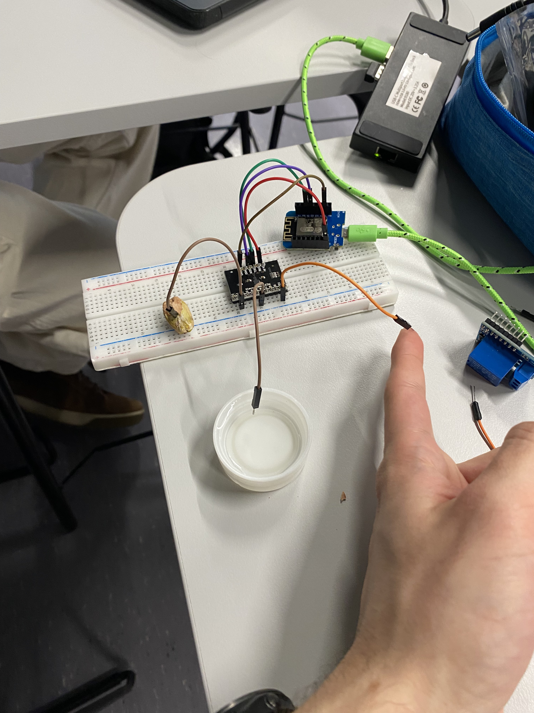
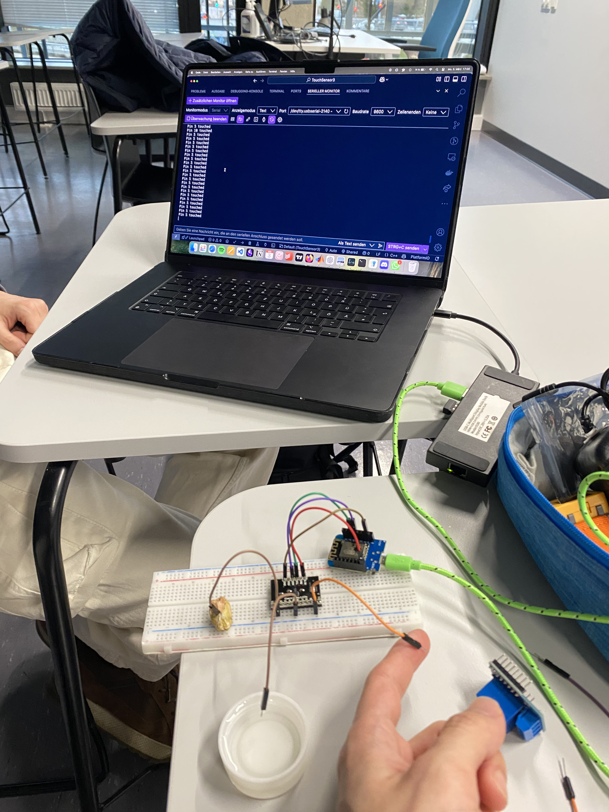
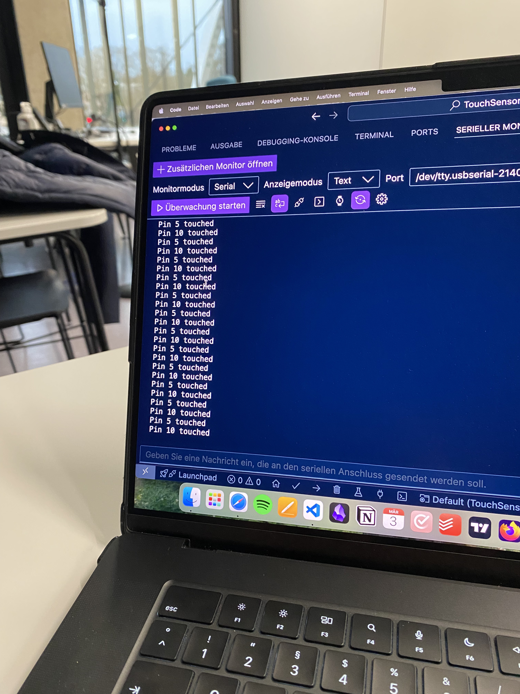
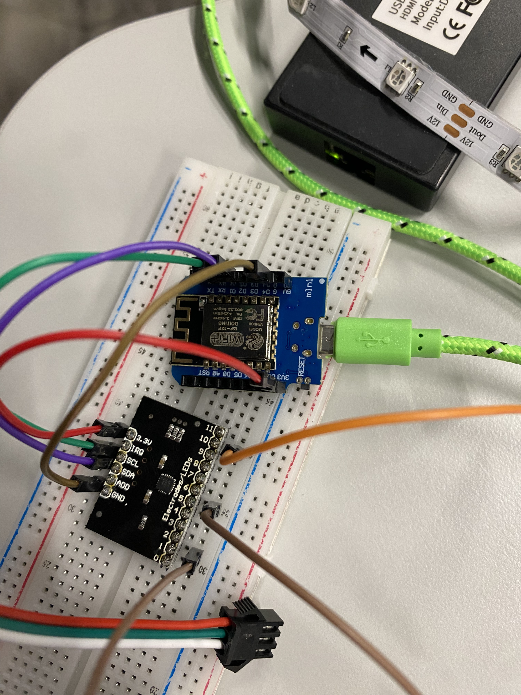

## Task 5 - Mini project: Bomb Defuse Challenge

**Notes** : We were unable to connect it with the M5, we try to updatde the M5 with out code for dispathcing a signal on S36 port but it was imposible, so we try first using the LED, then we use buttons to simulate the M5.

> Main code MCU: [main.cpp](./code/BombDefusal3/src/main.cpp)

> Main code M5: [main.cpp](./code/M5firmwareOverwrite/src/main.cpp)

### Task 5 - Using the LED

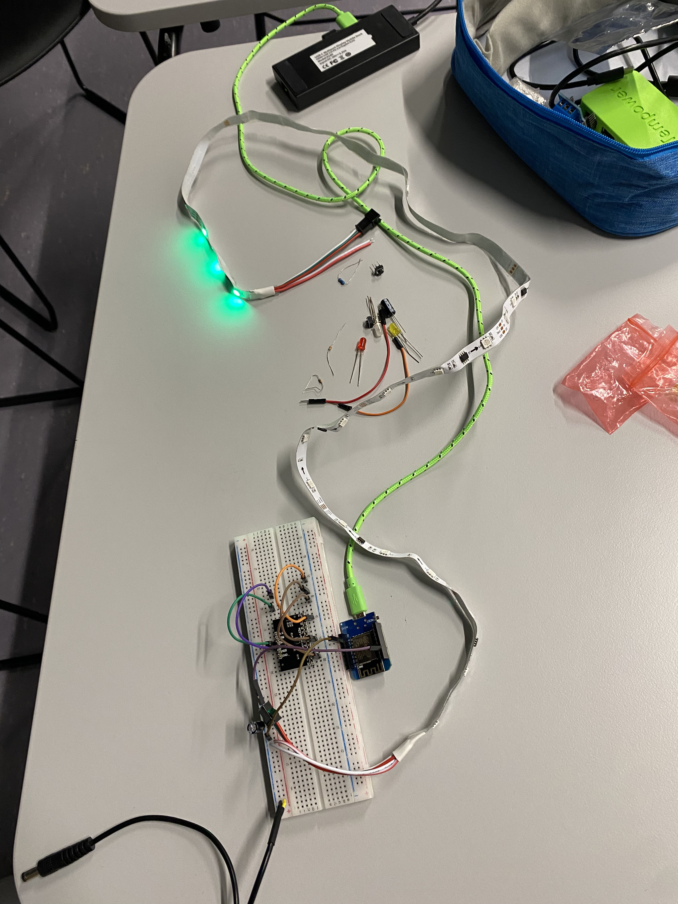
---

### Task 5 - Bottons instead of M5 

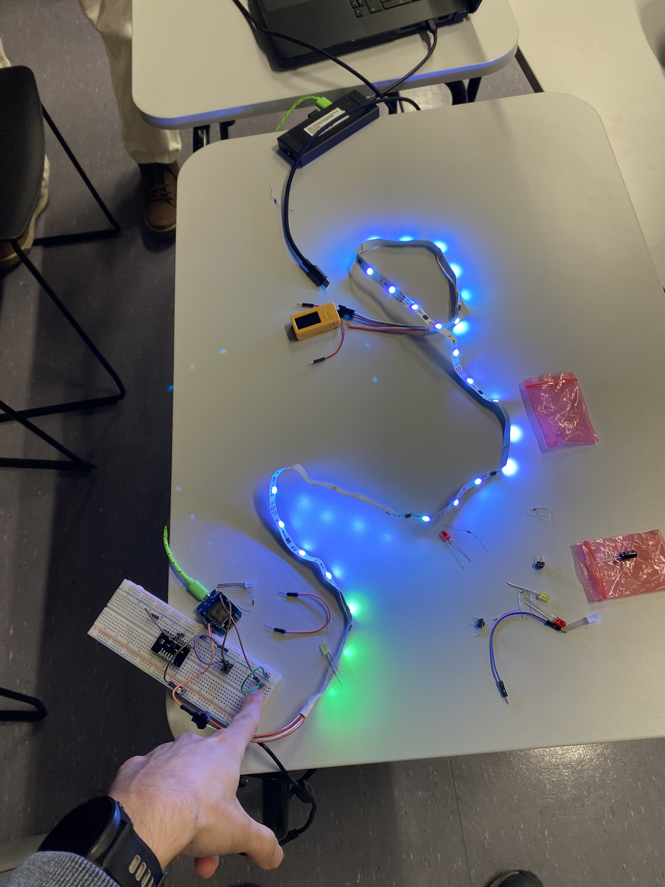
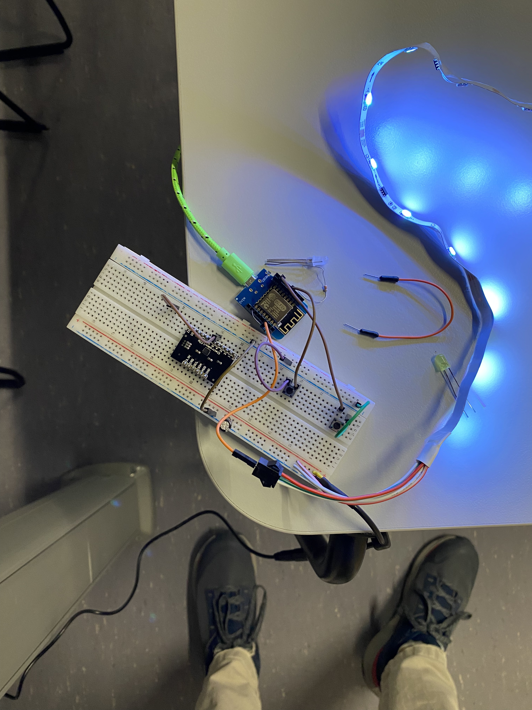

## Task 6 - Mini Project: Combination Challenge

**Notes** : For this one we decided to combine the touch sensor IC2 with the LED making a game, the one who touch more times wins, two players one start fromt he begining and the other from the end, Player 1 is green, player 2 is blue.

> Main code: [main.cpp](./code/TouchBomb3/src/main.cpp)

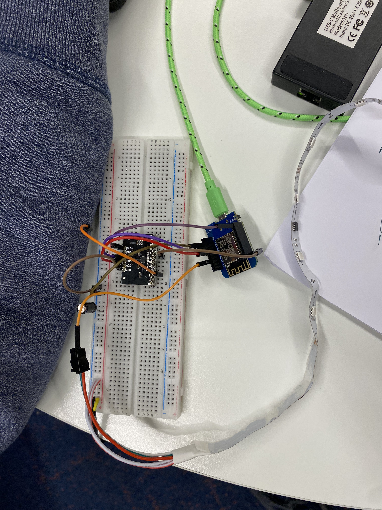
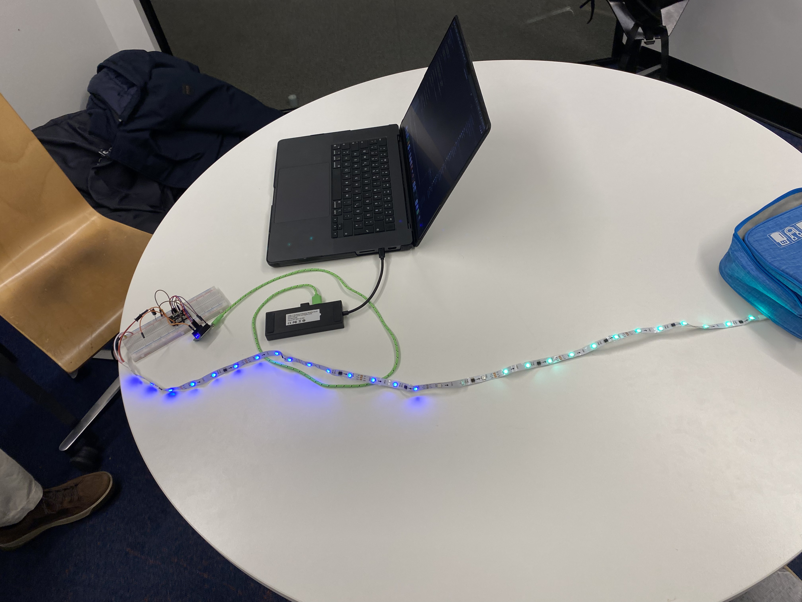

---

## Reflection 3
[Reflection 3](../Reflections/ref03.md)

