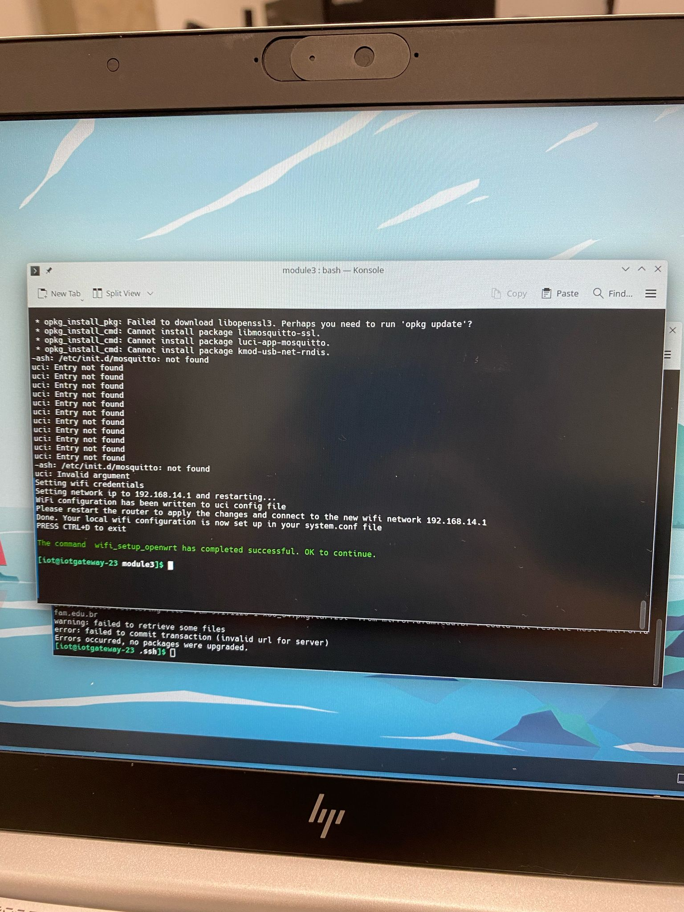
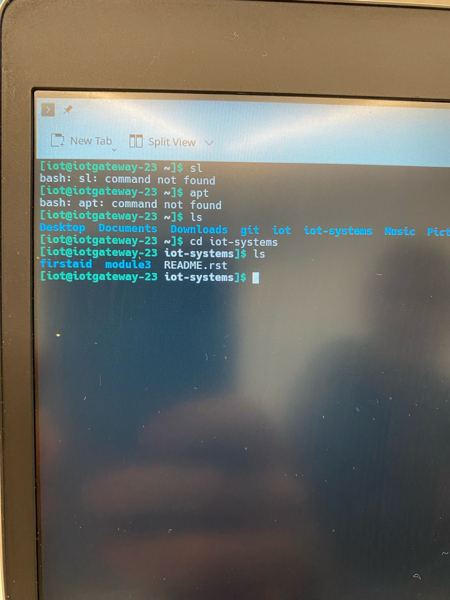
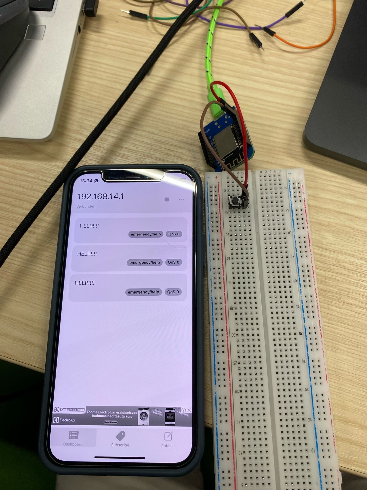
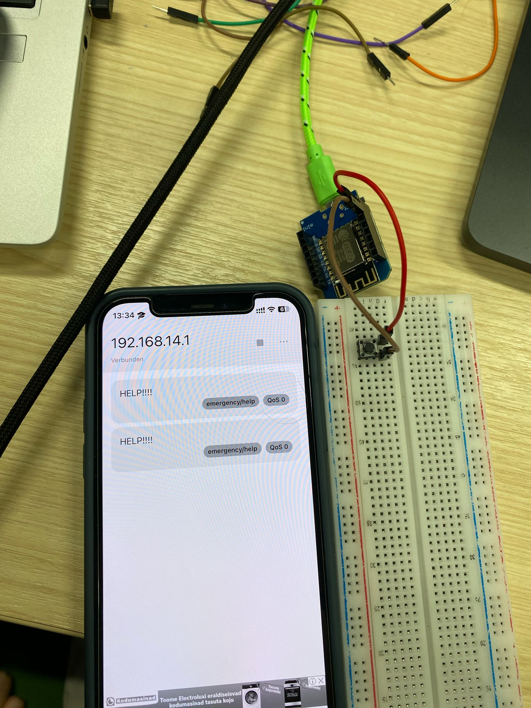
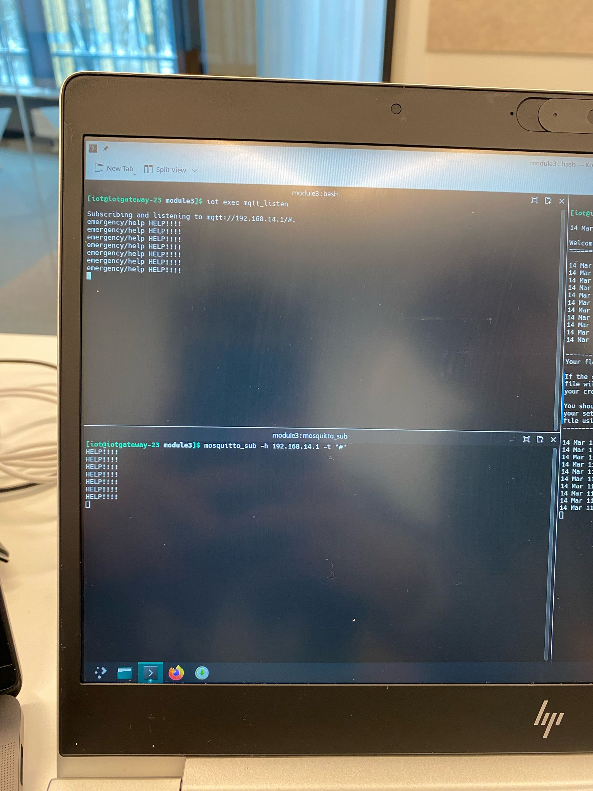
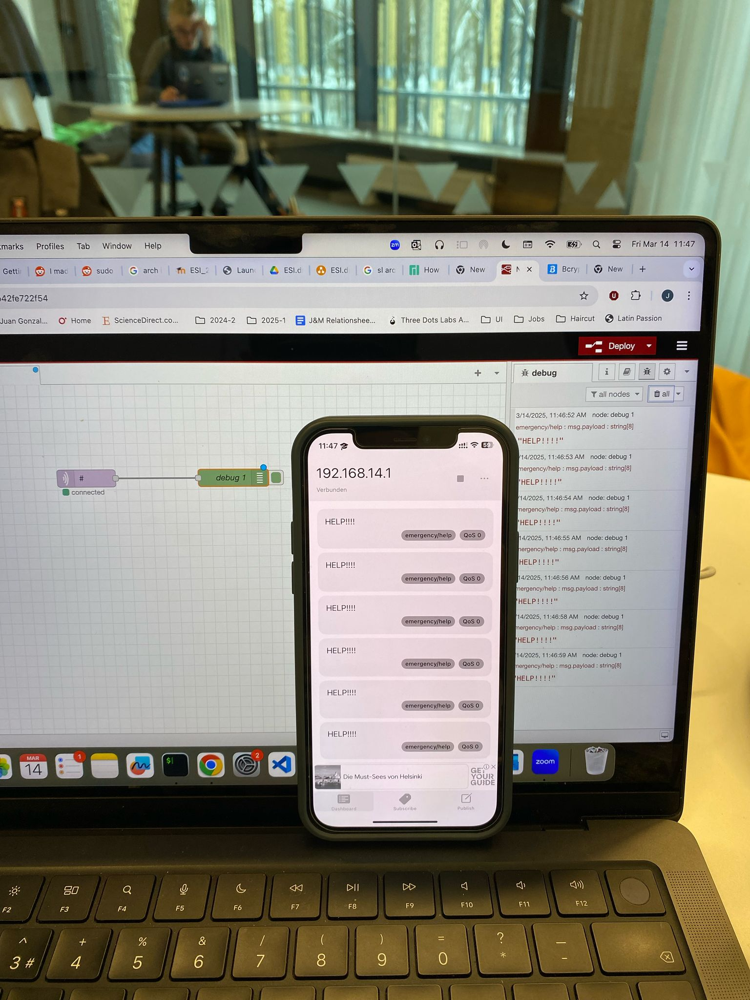
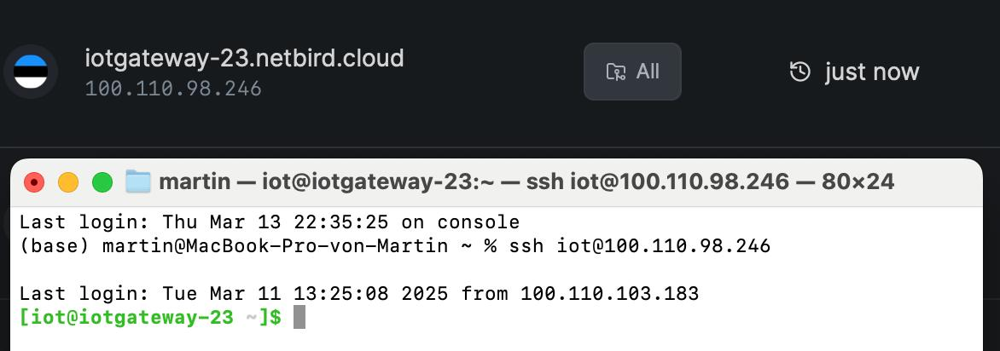

# Module 2

> **_NOTE:_**  All the work was with my teammate Martinm aka [LogicLobster](https://github.com/LogicLobster/IoT-Tartu-Spring25)

## Catalog

* Catalog could be accessed here: [catalog.md](../catalog.md)

## Reflections

### Reflection 4
[Reflection 4](../Reflections/ref04.md)

### Reflection 5
[Reflection 5](../Reflections/ref05.md)

## Tasks

### Task - Write a simple Network setup tutorial on Portfolio

Steps:
* Connect the router to the internet
* connect the computer to the router through cable on LAN port
* Go to the router address 192.168.0.1
* On devices configurations select a channel whose is not being used.
* On interface configuration set up the address 192.168.14.1 as the new ip adress range with a mask of 255.255.0.0
* reconect to the router.
* Set the SSID and password as desired.
* Go to the packages manager and install mosquitto-ssl, luci-app-mosquitto and luci-app-commands
* restart the router
* Once restarted, go to the dashboard, all should be ready to be used
* install MyMQTT on a phone and test it, connect to the network before and use the address 192.168.14.1:1883
* Enjoy!

### Task - Mini Project: IoTempower networking

**Notes** : For this project we use the iot cli, all good. We avoid using the usb tethering as our station is connected by WAN, but we did WiFi set up too.

### Task - Mini Project: FirstAid station emergency button

**Notes** : For this project we set up a client on the arduino using the libraries, then we send the message to the borker everytime the pin od the bottom was HIGH

> Main code: [main.cpp](./code/bottonMod3/src/main.cpp)

---

### Task - Mini Project: MQTT listens everywhere

**Notes** : For this one we add listeners everywhere.

---

### Task - Mini Project: remote access to the gateway

**Notes** : Tuneling configuration as showed in class.

<!-- 
### Task  - 

**Notes** : 

> Main code: [main.cpp](./code/Blink3/src/main.cpp)

---
 -->

