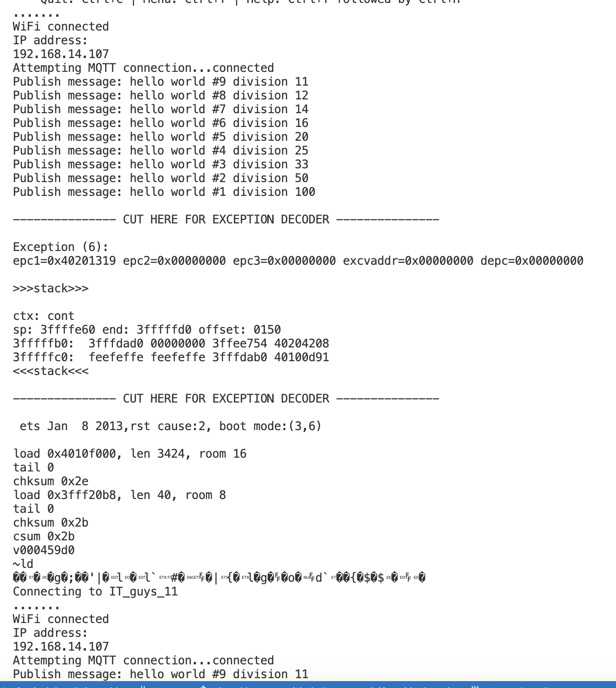

# Module 2

> **_NOTE:_**  All the work was with my teammate Martinm aka [LogicLobster](https://github.com/LogicLobster/IoT-Tartu-Spring25)

## Catalog

* Catalog could be accessed here: [catalog.md](../catalog.md)

## Reflections

### Reflection 6
[Reflection 4](../Reflections/ref06.md)

### Reflection 7
[Reflection 5](../Reflections/ref07.md)

## Tasks

### Task - Crash!

Divided by 0

> Main code: [main.cpp](./code/simplebreak/src/main.cpp)

``` c
value = value/0;
snprintf (msg, MSG_BUFFER_SIZE, "hello world #%ld", value);
Serial.print("Publish message: ");
```


--- 

> Main code: [main.cpp](./code/simplebreak/src/main_2.cpp)

``` c
--value;
snprintf (msg, MSG_BUFFER_SIZE, "hello world #%ld division %ld", value, 100/value);
```



--- 

> Main code: [main.cpp](./code/simplebreak/src/main_3.cpp)

``` c
char* msg = new char[512]; // Allocate space
sprintf(msg, "Hello at %ld.", millis());

static String extend_msg;
extend_msg += msg;
extend_msg += "And more";

// Publish without freeing memory
client.publish("test/output", extend_msg.c_str());
```


--- 


<!-- 
### Task  - 

**Notes** : 

> Main code: [main.cpp](./code/Blink3/src/main.cpp)


---


 -->


