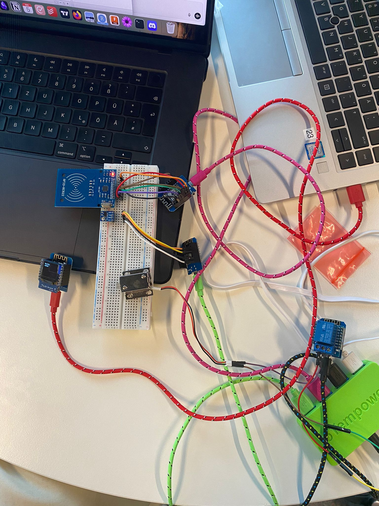
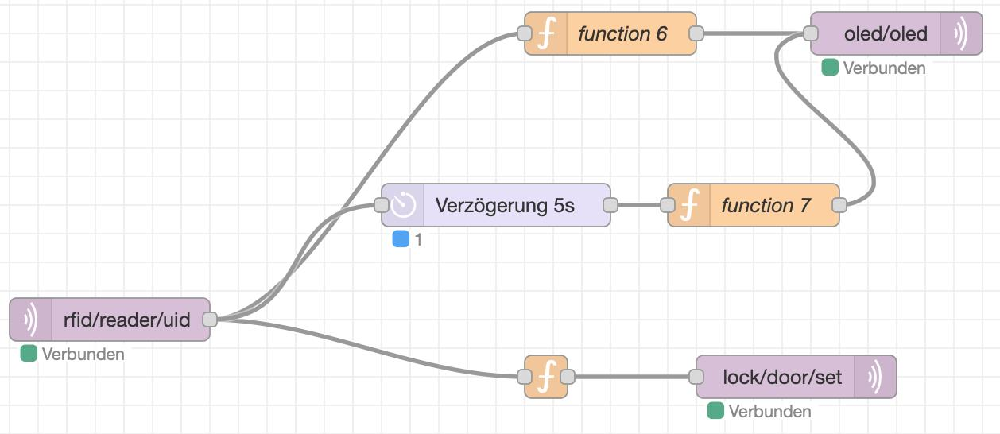
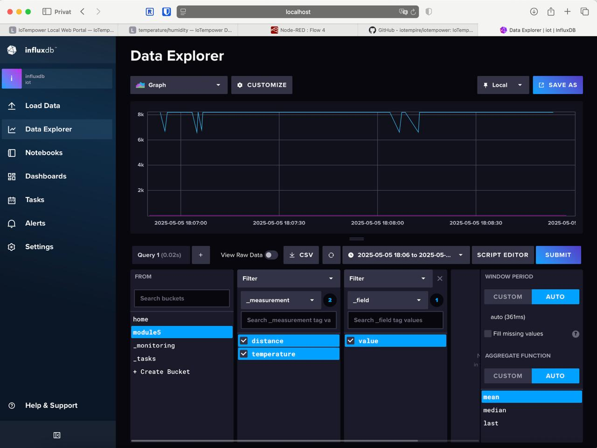
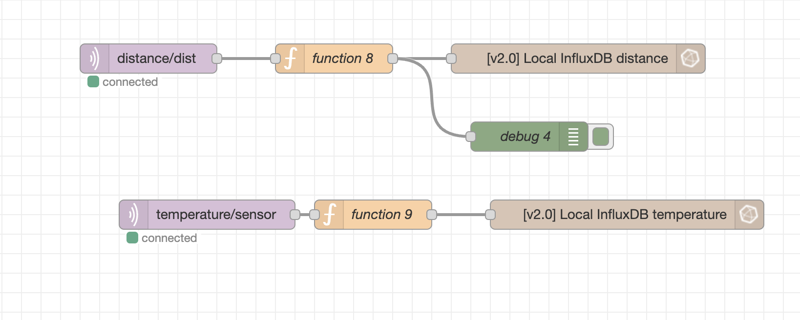
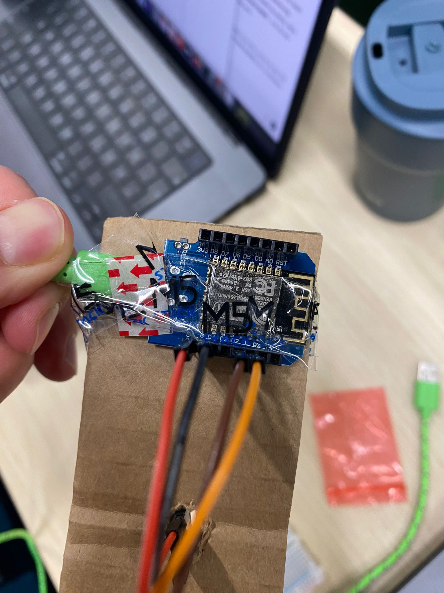
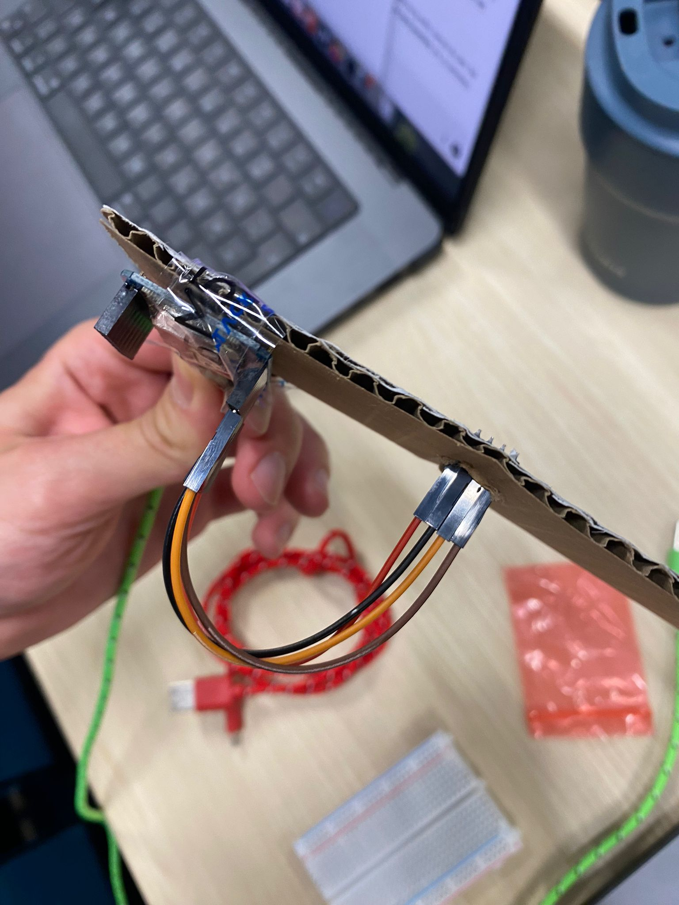
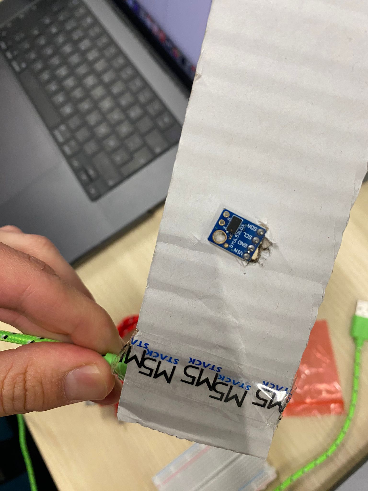
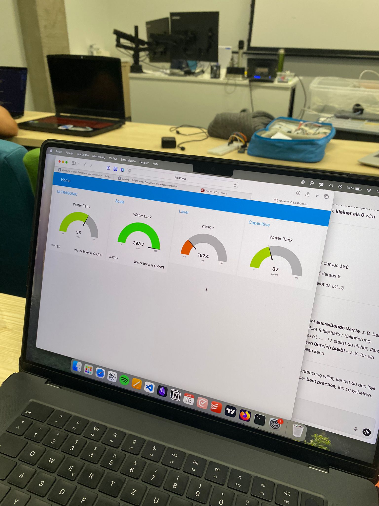
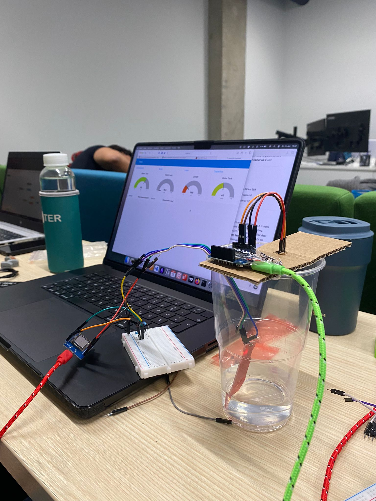
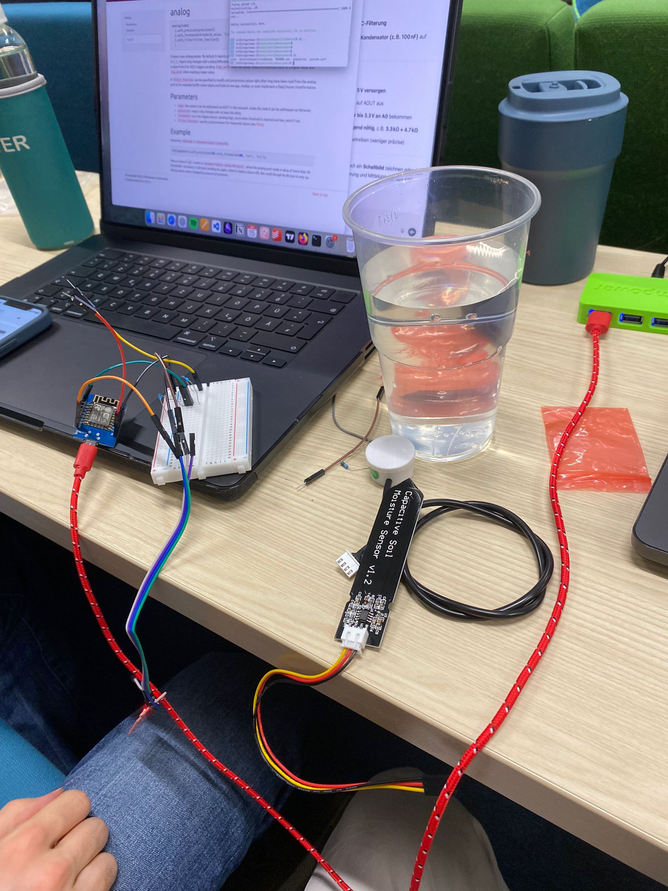

# Module 5

> **_NOTE:_**  All the work was with my teammate Martinm aka [LogicLobster](https://github.com/LogicLobster/IoT-Tartu-Spring25)

## Catalog

* Catalog could be accessed here: [catalog.md](../catalog.md)

## Tasks - Session 1

### Task  - Mini Project: First Node

**Notes** : Done using iot empire

> Main code: [main.cpp](./code/node1/setup.cpp)

### Task  - Mini Project: Second Node

**Notes** : Done using iot empire

> Main code: [main.cpp](./code/node2/setup.cpp)

### Mini Project: rebuild access control with IoTempower

**Notes** : Done using iot empire

> Distance code: [main.cpp](./code/distance/setup.cpp)

> Lock code: [main.cpp](./code/lock/setup.cpp)

> Oled code: [main.cpp](./code/oled/setup.cpp)

> rfid code: [main.cpp](./code/rfid/setup.cpp)

> Nodered: [nodered.json](./node-red/nodered.json)

> Video all working: [1.mp4](./videos/1.mp4)

### Mini Project: rebuild access control with IoTempower

**Notes** : Done using iot empire

> Distance code: [main.cpp](./code/distance/setup.cpp)

> Temperature code: [main.cpp](./code/temperature/setup.cpp)

## Tasks - Session 2

### Project: Liquids Measuring Project

**Notes** : Done using iot empire

> lazer code: [main.cpp](./code/lazer/setup.cpp)

> moistureCapacitiveSensor code: [main.cpp](./code/moistureCapacitiveSensor/setup.cpp)

<!-- 
### Task  - 

**Notes** : 

> Main code: [main.cpp](./code/Blink3/src/main.cpp)

---

 -->

> Node red integrator: [main.cpp](./nodered/full-integration.json)
> Video all working: [3_project.mp4](./videos/3_project.mp4)

